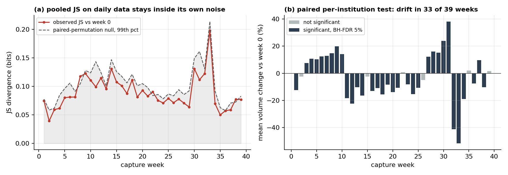
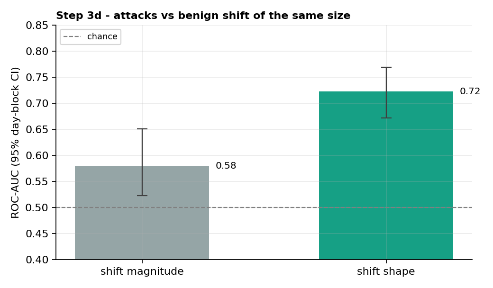

# Telling Drift from Attack

[](https://github.com/Amirikiarash/drift-aware-nids/actions/workflows/run-experiments.yml)

Measuring benign non-stationarity in real network traffic, as groundwork for
intrusion detection that can tell legitimate change from adversarial manipulation.

Deployed ML-based intrusion detectors face two kinds of distribution shift that
look alike but demand opposite responses: benign concept drift (the network
legitimately evolving) and adversarially induced shift (evasion or poisoning).
Before building anything that separates the two, the benign side has to be
measured on real traffic. That is what this repository does, step by step. Every
number and figure below is produced by the scripts in `experiments/` on real data,
and re-run from scratch on every push in CI.

## Key results

- **Benign drift is pervasive.** On 50 institutions of CESNET-TimeSeries24, a paired
  per-institution permutation test finds a significant traffic-level change against
  the first week in **33 of 39 weeks** (Benjamini-Hochberg FDR 5%). At the end of the
  spring semester, volume falls **52%**, in 98% of institutions. *(Steps 1, 1b)*
- **It breaks a static detector.** An IsolationForest calibrated to a 1% false-alarm
  rate (the calibration holds out of sample: 1.1% on held-out training weeks)
  averages **16.3%** over the following 29 weeks and peaks at **54.7%**. The inflation
  follows time since training (Spearman ρ = 0.70), not individual drift events: the
  decay is cumulative. *(Steps 2, 2c)*
- **The shape of a shift carries information its size does not.** Against benign
  windows matched to attacks on deviation magnitude, magnitude is near chance
  (ROC-AUC 0.58) while shift shape separates attacks at **0.72 (95% CI 0.67-0.77)**.
  *(Steps 3, 3d)*
- **Worst family, not average.** Port scans 0.97-1.00, DoS 0.82, botnet C2 **0.62**
  (range 0.56-0.66 across CV splits). Stealthy command-and-control remains the open
  problem. *(Step 3c)*

## Step 1: how much does real traffic drift on its own?

`experiments/step1_benign_drift.py` quantifies week-over-week distribution shift
in [CESNET-TimeSeries24](https://doi.org/10.1038/s41597-025-04603-x): 40 weeks of
real ISP traffic (Oct 2023 - Jul 2024). It takes the 50 most volume-stationary
institutions (so the drift is behavioural, not a sensor coming online), and for
`n_flows` and `n_packets` computes the Jensen-Shannon divergence of each capture
week's log-scaled distribution against week 0 (60 shared histogram bins, base-2,
so the score is bounded in [0, 1]).

The most shifted week reaches 0.198 bits of JS divergence at the end of the spring
semester, with December-January and the May exam period also elevated:

| capture week | week start | JS(n_flows) | likely event |
|---|---|---|---|
| 33 | 2024-05-27 | 0.198 | end of spring semester / exams |
| 30 | 2024-05-06 | 0.131 | May |
| 14 | 2024-01-15 | 0.131 | January exams |
| 9  | 2023-12-11 | 0.123 | pre-Christmas |
| 32 | 2024-05-20 | 0.123 | end of spring semester |


## Step 1b: is that drift distinguishable from noise?

A JS divergence has no meaning without a null: two samples of the *same* week also
differ. `experiments/step1b_calibrated_drift.py` calibrates the measurement. Because
the same institutions are observed every week, week 0 and week *w* are paired, and
under the null each institution's two weekly blocks are exchangeable. Two exact
permutation tests follow. Both respect the correlation between an institution's
days, which an iid bootstrap would ignore:

| test | statistic | null | weeks significant (BH-FDR 5%) |
|---|---|---|---|
| distributional | pooled JS divergence (Step 1) | swap each institution's two weeks | **0 / 39** |
| level | mean per-institution change in log volume | random sign flip per institution | **33 / 39** |

**Result.** The drift is real, but the Step 1 statistic cannot show it. On daily
data each institution contributes only 7 points per week, and pooled JS divergence
has too little power: even week 33 (0.198 bits) sits just below its null 99th
percentile (0.214; uncorrected p = 0.029). The paired level test, by contrast, is
unambiguous: 33 of 39 weeks differ from week 0 after FDR correction, and in week 33
mean volume falls 52% with 49 of 50 institutions moving the same way
(p = 0.00005). Steps 2c and later therefore use the level-change measurement, and
the JS numbers above should be read as descriptive only.



## Step 2: what does that drift do to a static detector?

`experiments/step2_detector_decay.py` freezes an IsolationForest on capture weeks
0-10 (per-institution features normalised with training-weeks statistics only),
calibrates its threshold to a 1% alarm rate, and scores the remaining 29 weeks.
The traffic contains no labelled attacks, so every alarm is a false alarm.

**Result.** The frozen detector's false-alarm rate inflates from the calibrated
1% to **16.3% on average** after the training period (16 times higher) and peaks
at **54.7%** in week 33, the week of the largest volume drop. A detector whose notion of
"normal" is frozen quietly turns benign change into operator noise; this is the
alert-fatigue failure mode that gets real detectors switched off.


## Step 2b: per-institution drift, and predictive detectors

`experiments/step2b_deeper_analysis.py` answers two objections.

**Is the drift an artefact of pooling institutions?** No. Measured against each
institution's own training baseline, **~0%** of institutions are off-baseline
during training, rising to **23%** on the high-JS weeks and **73%** at the week-33
peak.

**Do forecast-residual detectors (the class used in operational anomaly
prediction) behave differently?** A frozen seasonal-profile forecaster reaches a
**22%** false-alarm rate on the high-JS weeks (peaking at **62%**). A rolling
seasonal-naive forecaster that blindly adapts decays far less (**11%**). That
contrast is the research problem in one figure: adaptation is necessary, and blind
adaptation is exactly the surface an attacker can poison.


## Step 2c: what drives the decay?

`experiments/step2c_what_drives_decay.py` tests two things Step 2 assumes.

**Is the 1% calibration an in-sample artefact?** No. Leaving each training week out,
refitting, and recalibrating on the rest gives a held-out alarm rate of **1.1%**
(range 0.2-3.8%). The 16x inflation is real.

**Do false alarms follow drift events?** Across the 29 test weeks:

| predictor of weekly false-alarm rate | Spearman ρ | p |
|---|---|---|
| pooled JS divergence (Step 1) | -0.13 | 0.51 |
| absolute per-institution level change (Step 1b) | +0.26 | 0.18 |
| weeks elapsed since training | **+0.70** | < 0.001 |

**Result.** Apart from the week-33 peak, false alarms do not track individual drift
events; they track elapsed time. The decay is cumulative: the detector ages,
which means watching for drift events is not enough to know when to retrain.

## Step 3: can we tell a real attack from benign drift?

`experiments/step3_separability.py` moves to a dataset with real, labelled
attacks: [UGR'16](https://doi.org/10.1016/j.cose.2017.11.004), tier-3 ISP netflow
with scheduled attacks (DoS, botnet, scans) injected into real background traffic.
Its calibration period (Mar-Jun 2016, attack-free) is the benign baseline; the test
period (Jul-Aug 2016) is walked in 10-minute windows, each labelled attack or benign
from the ground-truth log (`labelblacklist` is background present in every single
minute, so it is not counted as a discrete attack). The question is not "did
something shift" but "is this shift an attack or benign", at a realistic 5.6%
attack base rate.

A naive drift detector only sees shift *magnitude*, i.e. how far a window has moved
from normal. We compare that against the *shape* of the shift: how concentrated it
is across features and how abruptly it arrives. With day-grouped 5-fold
cross-validation (windows from one day never straddle train and test):

| signal | PR-AUC | ROC-AUC |
|---|---|---|
| shift magnitude only (naive) | 0.28 | 0.69 |
| shift **shape** (concentration + abruptness) | **0.33** | **0.75** |

Pooled over all windows, shape leads magnitude by 0.08 ROC-AUC, but with attacks on
only 13 days the 95% day-block bootstrap interval of that gap is [-0.02, +0.16]:
suggestive, not established. Step 3d asks the sharper question.


## Step 3d: attacks vs benign shift of the same size

Most benign windows are small deviations, so the pooled comparison mixes "attack vs
quiet traffic" with the real question, "attack vs benign drift".
`experiments/step3d_magnitude_matched.py` matches the negative class on magnitude:
for each decile of attack-window magnitude it draws up to three benign windows from
the same band (480 attack vs 1,194 benign windows). Within that set, magnitude can
barely separate the classes by construction, so any remaining separability must
come from the shape of the shift.

| signal, magnitude-matched | ROC-AUC | 95% day-block CI | PR-AUC (base 0.29) |
|---|---|---|---|
| shift magnitude | 0.58 | 0.52-0.65 | 0.43 |
| shift **shape** | **0.72** | **0.67-0.77** | **0.56** |

**Result.** Against benign shift as large as the attack, the shape signal separates
attacks clearly, with an interval well clear of both chance and the magnitude
baseline. This is the claim the repository is built around, in its most direct
form: benign drift and attacks differ in *how* traffic moves, not only in *how far*.



## Step 3b: influence geometry and an adaptive adversary

`experiments/step3b_deep_separability.py` pushes Step 3 in the two directions a
reviewer asks for.

**An influence-geometry signal.** A small autoencoder is trained on benign traffic,
and for each minute we measure its last-layer update gradient: the norm, and the
alignment with the mean benign gradient. The norm factorises as
‖residual‖·‖hidden activation‖, so it is closely related to reconstruction error;
the alignment term is the part an IsolationForest cannot provide.

| signals | PR-AUC | ROC-AUC |
|---|---|---|
| shift magnitude (naive) | 0.30 | 0.69 |
| shape | 0.39 | 0.76 |
| gradient geometry | 0.37 | 0.75 |
| shape + gradient | 0.40 | 0.77 |
| all | **0.42** | **0.78** |

These are single-split point estimates; given the Step 3 interval, the increments
between the last three rows are not individually significant.

**An adaptive adversary.** An attacker who knows the detector will try to look like
benign drift. We model one that blends each attack minute toward the mean benign
profile in standardised feature space, with blend weight λ ("cover"). At λ = 0.2 the
detector drops from ROC-AUC 0.76 to 0.68; at λ = 0.8 to 0.62, and it stays above
chance throughout. The blend is a feature-space proxy for cover traffic rather than
a traffic-level simulation, and it does not use the detector's gradients. A fully
optimised adversary is on the roadmap.


## Step 3c: separability per attack family

A pooled number hides that some attacks are easy and others nearly invisible.
`experiments/step3c_per_family.py` reports the discriminator's ROC-AUC one attack
family at a time, against a clean benign negative class (windows free of every
discrete attack label). All attacks fall on 13 days, so a single CV split is noisy
for the smaller families; each is scored over 30 random day-to-fold assignments:

| attack family | ROC-AUC, median | range over 30 splits |
|---|---|---|
| port scan (44) | 1.00 | 1.00-1.00 |
| port scan (11) | 0.97 | 0.95-0.97 |
| DoS | 0.82 | 0.81-0.82 |
| botnet (Neris C2) | **0.62** | 0.56-0.66 |

Scans and floods are separable; stealthy botnet command-and-control is only
modestly above chance. That worst-family number, not the pooled average, is the
real state of this work, and it is why the roadmap targets an adaptive,
low-and-slow adversary.


## Limitations

- **Seasonality vs drift.** CESNET's largest shifts follow the academic calendar. A
  detector trained on a full year would absorb some of them; the 11-week training
  window is realistic for a newly deployed detector but not for a mature one.
- **One attack dataset, 13 attack days.** UGR'16 is real traffic, but its attacks
  are scheduled and injected. Intervals are wide for that reason, and the botnet
  family in particular is split-sensitive.
- **Adversary.** The adaptive adversary blends in standardised feature space and is
  not gradient-optimised against the detector.
- **Daily aggregation.** The committed CESNET subset is daily, which limits the power
  of distributional tests (Step 1b). Finer aggregations are available through
  `cesnet-tszoo`.

## Run it

```bash
pip install -r requirements.txt
python experiments/step1_benign_drift.py         # -> results/step1_benign_drift.csv
python experiments/step1b_calibrated_drift.py    # -> results/step1b_calibrated_drift.csv
python experiments/step2_detector_decay.py       # -> results/step2_detector_decay.csv
python experiments/step2b_deeper_analysis.py     # -> results/step2b_deeper_analysis.csv
python experiments/step2c_what_drives_decay.py   # -> results/step2c_what_drives_decay.csv
python experiments/fetch_ugr16.py                # downloads UGR'16 v1 into data/ugr16/ (~90 MB)
python experiments/step3_separability.py         # -> results/step3_separability.csv
python experiments/step3d_magnitude_matched.py   # -> results/step3d_magnitude_matched.csv
python experiments/step3b_deep_separability.py   # -> results/step3b_*.csv
python experiments/step3c_per_family.py          # -> results/step3c_per_family.csv
python experiments/make_figures.py               # -> figures/*.png
```

The real daily institution data (9.2 MB) is committed under `data/`, so the CESNET
steps need no download. All randomness is seeded; the CI workflow
`run-experiments.yml` reproduces every result and figure from scratch on each
push and uploads them as an artifact.

## Roadmap: separating the two shifts (the open problem)

Steps 1-2c establish the premise (benign drift is pervasive and breaks static
detectors cumulatively, so adaptation is unavoidable, but blind adaptation is a
poisoning surface); Steps 3-3d show that the shape of a shift separates attacks
from benign shift of the same size. The open research is to push that signal to
operationally useful levels on the hard families, and to close the loop with a
detector.

- **Harden Step 3.** TracIn self-influence and spectral-signature signals; a
  gradient-*optimised* alignment-minimising adversary; hard benign confounders in
  the negative class (server onboarding, flash crowds); a second attack dataset.
- **Finer-grained drift measurement.** Repeat Step 1b at 10-minute aggregation,
  where distributional tests gain the power daily data lacks.
- **Step 4: a drift-source-aware detector** that adapts to benign shift under a
  forgetting bound while resisting adversarial shift under an influence cap.

This question is distinct from measuring whether drift and adversarial
perturbations compound (Apruzzese, Fass & Pierazzi, AISec 2024) and from
benchmarking degradation under temporal shift (AnoShift, NeurIPS 2022): here the
defender must attribute *which* shift is occurring, not just detect that some
shift happened.

## Data

- Koumar, Hynek, Čejka & Šiška, *CESNET-TimeSeries24*, Scientific Data (2025),
  [doi:10.1038/s41597-025-04603-x](https://doi.org/10.1038/s41597-025-04603-x).
  Loaded via the [cesnet-tszoo](https://github.com/CESNET/cesnet-tszoo) library;
  the committed daily-institution subset and its provenance are documented in
  [`data/README.md`](data/README.md).
- Maciá-Fernández, Camacho, Magán-Carrión, García-Teodoro & Therón, *UGR'16: A new
  dataset for the evaluation of cyclostationarity-based network IDSs*, Computers &
  Security (2018), [doi:10.1016/j.cose.2017.11.004](https://doi.org/10.1016/j.cose.2017.11.004).
  Per-minute features from
  [josecamachop/UGR16_FeatureData](https://github.com/josecamachop/UGR16_FeatureData).

## Author

Kiarash Amiri, amiri.kiarash@outlook.com, [linkedin.com/in/kiarash-amiri](https://www.linkedin.com/in/kiarash-amiri)

This project grew out of watching detection rules go stale in production.
