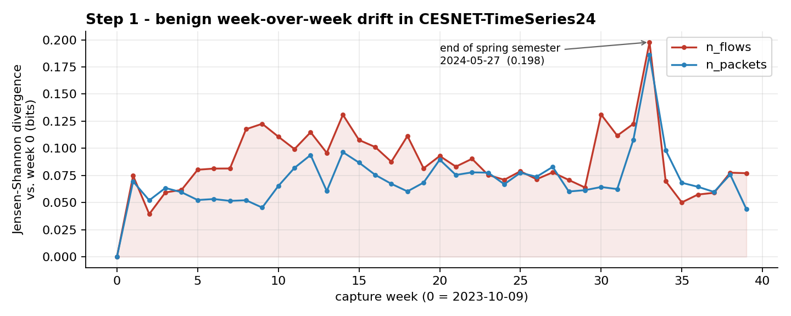
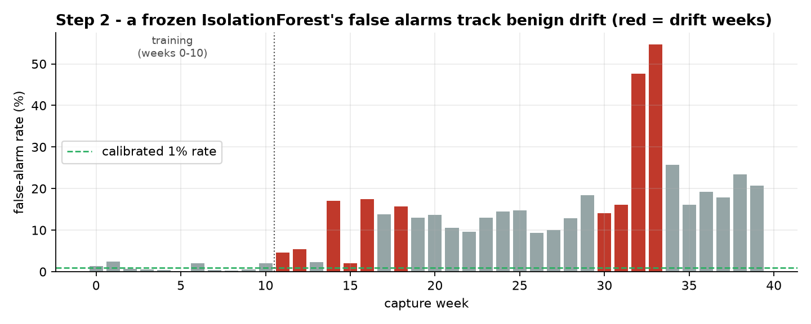
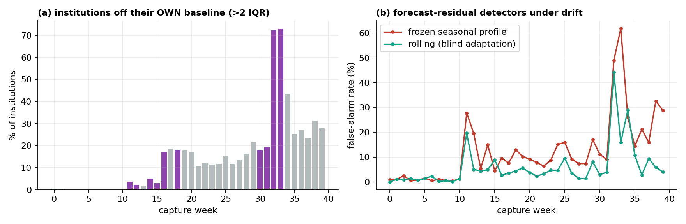
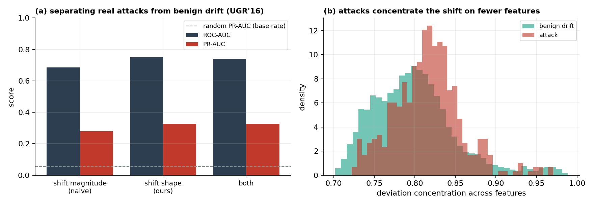
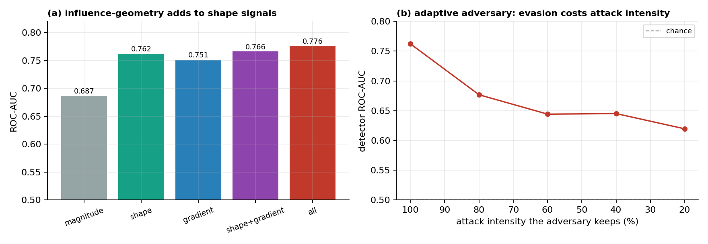
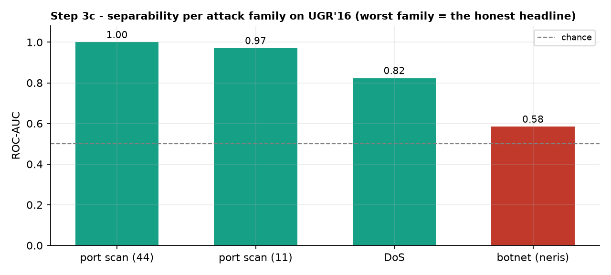

# Telling Drift from Attack

Measuring benign non-stationarity in real network traffic, as groundwork for
intrusion detection that can tell legitimate change from adversarial manipulation.

Deployed ML-based intrusion detectors face two kinds of distribution shift that
look alike but demand opposite responses: benign concept drift (the network
legitimately evolving) and adversarially induced shift (evasion or poisoning).
Before building anything that separates the two, the benign side has to be
measured on real traffic. That is what this repository does, step by step. Every
number and figure below is produced by the scripts in `experiments/` on the real
CESNET data committed under `data/`, and re-run on every push in CI.

## Step 1 — how much does real traffic drift on its own?

`experiments/step1_benign_drift.py` quantifies week-over-week distribution shift
in [CESNET-TimeSeries24](https://doi.org/10.1038/s41597-025-04603-x): 40 weeks of
real ISP traffic (Oct 2023 – Jul 2024). It takes the 50 most volume-stationary
institutions (so the drift is behavioural, not a sensor coming online), and for
`n_flows` and `n_packets` computes the Jensen-Shannon divergence of each capture
week's log-scaled distribution against week 0 (60 shared histogram bins, base-2,
so the score is bounded in [0, 1]).

**Result.** Benign drift is real, sustained, and it tilts with the academic
calendar. The most shifted week reaches **0.198 bits** of JS divergence with no
attack involved — the exam/end-of-semester period — and the December–January
holidays and exams stand out too:

| capture week | week start | JS(n_flows) | likely event |
|---|---|---|---|
| 33 | 2024-05-27 | 0.198 | end of spring semester / exams |
| 30 | 2024-05-06 | 0.131 | May |
| 14 | 2024-01-15 | 0.131 | January exams |
| 9  | 2023-12-11 | 0.123 | pre-Christmas |
| 32 | 2024-05-20 | 0.123 | end of spring semester |



## Step 2 — what does that drift do to a static detector?

`experiments/step2_detector_decay.py` freezes an IsolationForest on capture weeks
0–10 (per-institution features normalised with training-weeks statistics only),
calibrates its threshold to a 1% alarm rate, and scores the remaining 29 weeks.
The traffic contains no labelled attacks, so every alarm is a false alarm.

**Result.** The frozen detector's false-alarm rate inflates from the calibrated
1% to **16× higher on average** after the training period, averages **19.5%** on
exactly the drift weeks identified in Step 1, and peaks at **54.7%** in week 33 —
the same week Step 1 flags. Two independent measurements — a model-free
distributional distance and a model's alarm behaviour — point to the same weeks.
A detector whose notion of "normal" is frozen quietly turns benign drift into
operator noise; this is the alert-fatigue failure mode that gets real detectors
switched off.



## Step 2b — deeper: per-institution drift, and predictive detectors

`experiments/step2b_deeper_analysis.py` answers two objections.

**Is the drift an artefact of pooling institutions?** No. Measured against each
institution's own training baseline, **~0%** of institutions are off-baseline
during training, rising to **23%** on the drift weeks and **73%** at the week-33
peak. The drift is broad, not a pooling artefact.

**Do forecast-residual detectors (the class used in operational anomaly
prediction) behave differently?** A frozen seasonal-profile forecaster reaches a
**22%** false-alarm rate on the drift weeks (peaking at **62%**). A rolling
seasonal-naive forecaster that blindly adapts decays far less (**11%**). That
contrast is the whole research problem in one figure: adaptation is necessary,
and blind adaptation is exactly the surface an attacker can poison.



## Step 3 — can we tell a real attack from benign drift?

`experiments/step3_separability.py` moves to a dataset with real, labelled
attacks: [UGR'16](https://doi.org/10.1016/j.cose.2017.11.004) — tier-3 ISP netflow
with scheduled attacks (DoS, botnet, scans) injected into real background traffic.
Its calibration period is the benign baseline; the test period is walked in
10-minute windows, each labelled attack or benign from the ground-truth log
(`labelblacklist` is background present in every single minute, so it is not
counted as a discrete attack). The question is not "did something shift" but "is
this shift an attack or benign drift", at a realistic 5.6% attack base rate.

A naive drift detector only sees shift *magnitude* — how far a window has moved
from normal. We compare that against the *shape* of the shift: how concentrated it
is across features and how abruptly it arrives. With day-grouped 5-fold
cross-validation (windows from one day never straddle train and test):

| signal | PR-AUC | ROC-AUC |
|---|---|---|
| shift magnitude only (naive) | 0.28 | 0.69 |
| shift **shape** (concentration + abruptness) | **0.33** | **0.75** |

The shape of the shift separates attacks from benign drift better than its size:
attacks concentrate the deviation on a few features and arrive abruptly, while
benign drift is broad and gradual. The gap is real but modest — strengthening it
is the open research below.



## Step 3b — deeper: influence geometry and an adaptive adversary

`experiments/step3b_deep_separability.py` pushes Step 3 in the two directions a
reviewer asks for.

**An influence-geometry signal.** Step 3's signals are model-free. Here a small
autoencoder is trained on benign traffic, and for each minute we measure how its
update gradient behaves — its norm (how hard the point pushes the model) and its
alignment with the average benign gradient. This is the signal an IsolationForest
cannot give (it has no gradient), and it carries real, independent information:

| signals | PR-AUC | ROC-AUC |
|---|---|---|
| shift magnitude (naive) | 0.30 | 0.69 |
| shape | 0.39 | 0.76 |
| gradient geometry | 0.37 | 0.75 |
| shape + gradient | 0.40 | 0.77 |
| all | **0.42** | **0.78** |

**An adaptive adversary.** A static evaluation is unrealistic — a real attacker who
knows the detector will try to look like benign drift. We model one that blends the
attack toward the average benign profile, spending a fraction of the window on
benign cover traffic. It works — but at a price: to pull the detector from ROC-AUC
0.76 down to ~0.62 the attacker has to give up about 80% of the attack's intensity,
and even then the detector stays above chance. Evasion is possible but costly.



## Step 3c — the honest headline: separability per attack family

A pooled number hides that some attacks are easy and others nearly invisible.
`experiments/step3c_per_family.py` reports the discriminator's AUROC one attack
family at a time, against a clean benign negative class (day-grouped CV):

| attack family | ROC-AUC |
|---|---|
| port scan | 0.97–1.00 |
| DoS | 0.82 |
| botnet (Neris C2) | 0.58 |

Scans and floods are trivially separable; stealthy botnet command-and-control is
barely above chance. That worst-family number — not the pooled average — is the
honest state of the art here, and it is exactly why the roadmap targets an
adaptive, low-and-slow adversary.



## Run it

```bash
pip install -r requirements.txt
python experiments/step1_benign_drift.py         # -> results/step1_benign_drift.csv
python experiments/step2_detector_decay.py       # -> results/step2_detector_decay.csv
python experiments/step2b_deeper_analysis.py     # -> results/step2b_deeper_analysis.csv
python experiments/fetch_ugr16.py                # downloads UGR'16 v1 into data/ugr16/ (~90 MB)
python experiments/step3_separability.py         # -> results/step3_separability.csv
python experiments/step3b_deep_separability.py   # -> results/step3b_*.csv
python experiments/step3c_per_family.py          # -> results/step3c_per_family.csv
python experiments/make_figures.py               # -> figures/*.png
```

The real daily institution data (9.2 MB) is committed under `data/`, so nothing
is downloaded. All randomness is seeded (`SEED = 42`); the CI workflow
`run-experiments.yml` reproduces every result and figure from scratch on each
push and uploads them as an artifact.

## Roadmap — separating the two shifts (the open problem)

Steps 1–2b establish the premise (benign drift is real and breaks static
detectors, so adaptation is unavoidable but blind adaptation is a poisoning
surface); Step 3 shows a first, modest separability signal on real attacks. The
open research is to push that signal from "real but modest" to operationally
useful, and to close the loop with a detector.

- **Finish hardening Step 3.** Step 3b adds one influence-geometry family
  (autoencoder gradient norm and alignment) and one adaptive adversary
  (cover-traffic). Still to do: TracIn self-influence and spectral-signature
  signals; a fully gradient-*optimised* alignment-minimising adversary (not just
  cover-traffic); hard benign confounders in the negative class (server
  onboarding, flash crowds); and block-bootstrap confidence intervals on every
  reported number.
- **Step 4 — a drift-source-aware detector** that adapts to benign shift under a
  forgetting bound while resisting adversarial shift under an influence cap.

This question is distinct from measuring whether drift and adversarial
perturbations compound (Apruzzese, Fass & Pierazzi, AISec 2024) and from
benchmarking degradation under temporal shift (AnoShift, NeurIPS 2022): here the
defender must attribute *which* shift is occurring, not just detect that some
shift happened.

## Data

- Koumar, Hynek, Čejka & Šiška, *CESNET-TimeSeries24*, Scientific Data (2025),
  [doi:10.1038/s41597-025-04603-x](https://doi.org/10.1038/s41597-025-04603-x).
  Loaded via the [cesnet-tszoo](https://github.com/CESNET/cesnet-tszoo) library;
  the committed daily-institution subset and its provenance are documented in
  [`data/README.md`](data/README.md).

## Author

Kiarash Amiri — amiri.kiarash@outlook.com — [linkedin.com/in/kiarash-amiri](https://www.linkedin.com/in/kiarash-amiri)

This project grew out of watching detection rules go stale in production.
